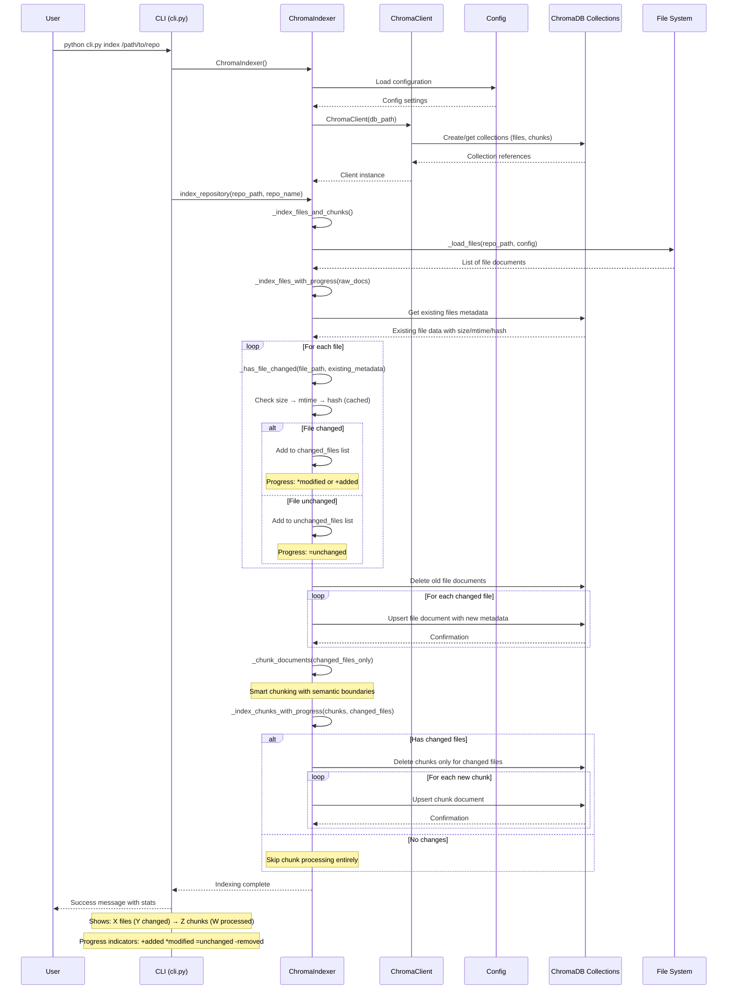
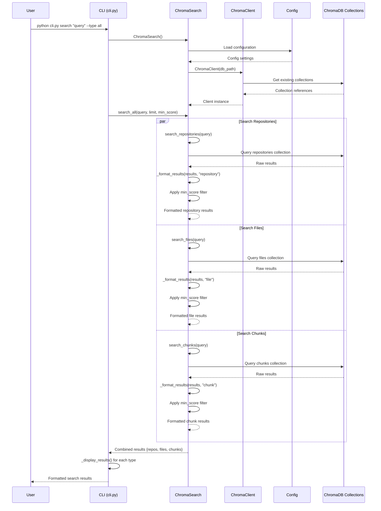
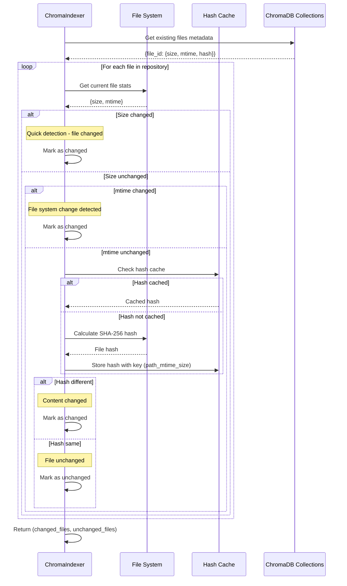
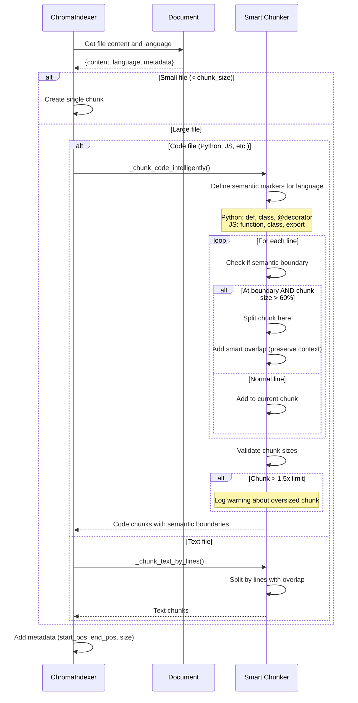
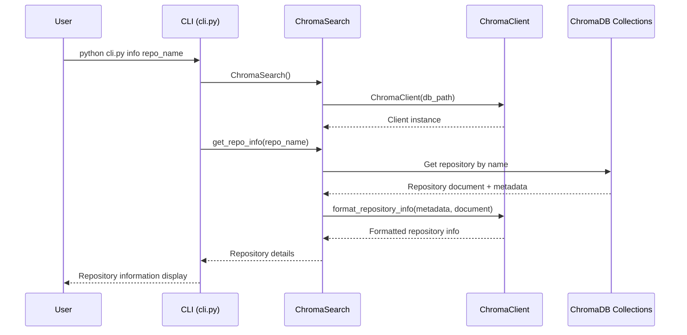
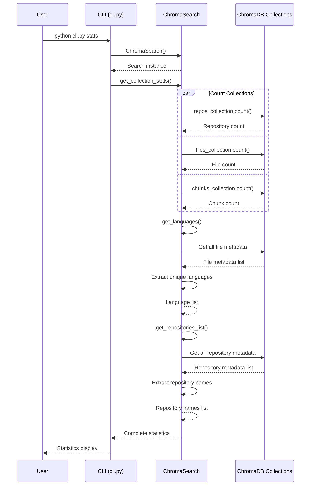

# Code Search System - Sequence Diagram

The system follows a three-layer architecture with optimized change detection:
- **CLI Layer**: User interface (cli.py)
- **Service Layer**: Business logic with intelligent change detection (chroma_indexer.py, chroma_search.py)
- **Data Layer**: Database abstraction with caching (chroma_client.py, ChromaDB)

## Indexing Flow

## Search Flow

## Change Detection Flow

## Smart Chunking Process

## Repository Information Retrieval

## Statistics and Collection Management

